# Auth Service

A production-minded authentication service built with Spring Boot, Spring Security, JWT, PostgreSQL, Flyway, Docker, and CI support.

## Why This Project Stands Out

This project is designed to showcase the backend skills recruiters usually look for in a strong Java project:

- secure JWT-based authentication with refresh-token flow
- role-based authorization for `USER` and `ADMIN`
- PostgreSQL persistence with Flyway migrations
- request validation and structured error handling
- unit tests for auth and token logic
- Dockerized local setup
- Postman collection for quick API testing
- GitHub Actions CI for automated verification

## Tech Stack

- Java 21
- Spring Boot 3
- Spring Security
- Spring Data JPA
- PostgreSQL
- Flyway
- JJWT
- Swagger / OpenAPI
- JUnit 5 + Mockito
- Docker Compose

## Features

- User signup
- User login
- Refresh access token
- Logout with refresh-token revocation
- Protected authenticated endpoint
- Protected admin-only endpoint
- Seeded demo users for quick walkthrough
- Swagger UI at `/swagger-ui/index.html`
- Health endpoint at `/actuator/health`

## API Summary

| Method | Endpoint | Description |
| --- | --- | --- |
| `POST` | `/auth/v1/signup` | Register a new user |
| `POST` | `/auth/v1/login` | Authenticate and receive tokens |
| `POST` | `/auth/v1/refresh-token` | Issue a new access token |
| `POST` | `/auth/v1/logout` | Revoke a refresh token |
| `GET` | `/api/v1/me` | Authenticated user endpoint |
| `GET` | `/api/v1/admin` | Admin-only endpoint |

## Local Setup

### 1. Configure environment variables

Use the sample file as a reference:

```bash
.env.example
```

Important variables:

- `POSTGRES_HOST`
- `POSTGRES_PORT`
- `POSTGRES_DB`
- `POSTGRES_USERNAME`
- `POSTGRES_PASSWORD`
- `JWT_SECRET`

`JWT_SECRET` must be a Base64-encoded secret key.

### 2. Start PostgreSQL

You can use your own PostgreSQL instance or Docker Compose.

### Demo Credentials

- `demo_user` / `Password1`
- `demo_admin` / `AdminPass1`

### 3. Run the application

```bash
./gradlew test
./gradlew :app:bootRun
```

### Demo Profile For Screenshots

If you want a zero-setup demo for README screenshots and recruiter walkthroughs, run:

```bash
./gradlew app:bootRun --args='--server.port=9900 --spring.profiles.active=demo'
```

This profile uses an in-memory H2 database, applies the same Flyway migration, and seeds:

- `demo_user` / `Password1`
- `demo_admin` / `AdminPass1`

### 4. Open Swagger

```text
http://localhost:9898/swagger-ui/index.html
```

## Docker

Build the application JAR first, then run Docker Compose:

```bash
./gradlew build
docker compose up --build
```

## Testing

Run:

```bash
./gradlew test
```

Current automated coverage includes:

- JWT generation and validation logic
- refresh-token creation and revocation logic
- auth controller flow unit tests

## Postman Collection

You can test APIs using the Postman collection included in the repository.

Path:

```text
postman/auth-service-collection.json
```

Recommended Postman variables:

- `baseUrl`
- `accessToken`
- `refreshToken`

## Architecture And Flow

- Architecture diagram: `docs/architecture-diagram.md`
- Auth flow diagram: `docs/auth-flow.md`
- Example request payloads: `docs/api-examples.md`
- Live demo responses: `docs/live-demo-output.md`

## Database Migrations

Flyway migration scripts are stored in:

```text
app/src/main/resources/db/migration
```

The initial migration creates:

- `users`
- `roles`
- `users_roles`
- `refresh_tokens`

It also seeds:

- `ROLE_USER`
- `ROLE_ADMIN`

## Screenshots

The screenshot plan is tracked in `docs/SCREENSHOT-CHECKLIST.md`.

### Swagger UI Overview
Full API documentation view for quick recruiter scanning.

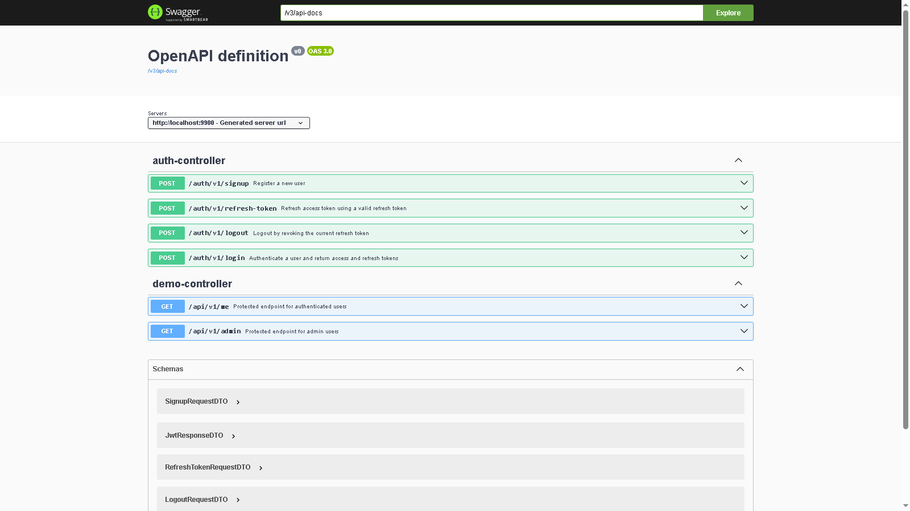

### Swagger Auth Request Example
Expanded auth endpoint showing request and response structure.

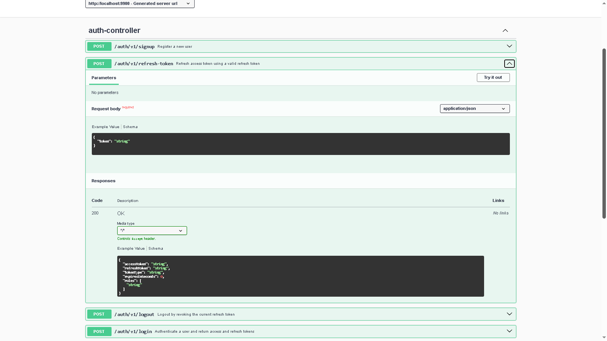

### Swagger Schemas
Schema definitions for request and response payloads.

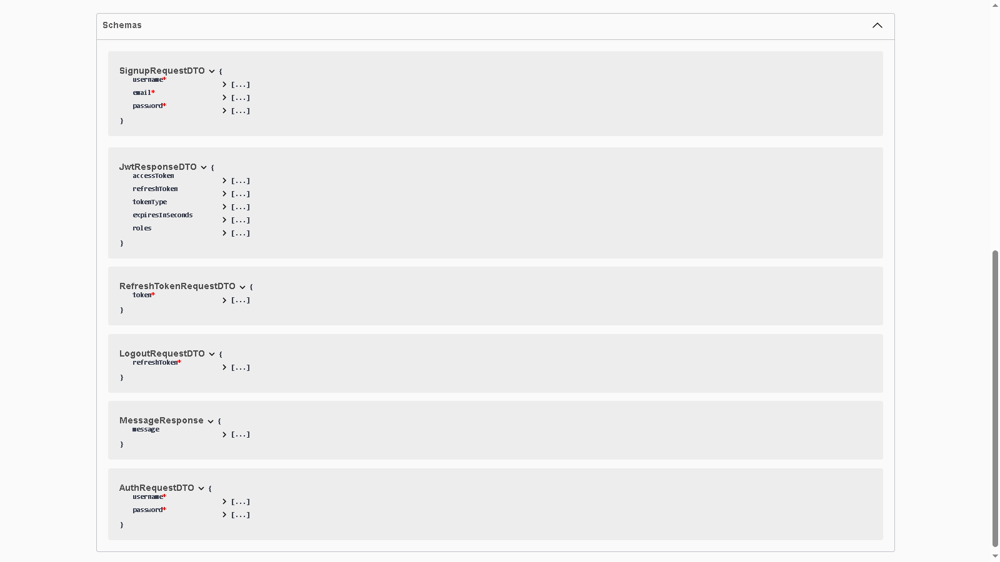

### Swagger Demo Section
Additional Swagger view for a stronger recruiter walkthrough.

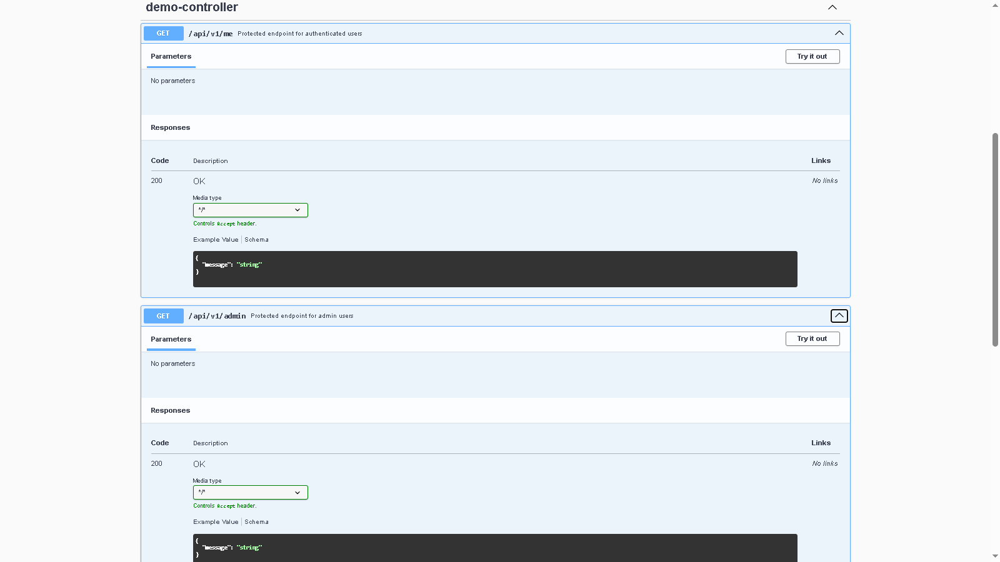

### Signup Success
Shows successful registration and token issuance.

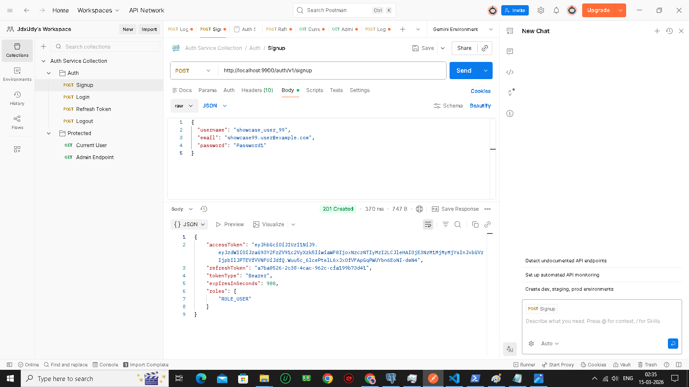

### Login Success
Shows access-token and refresh-token generation.

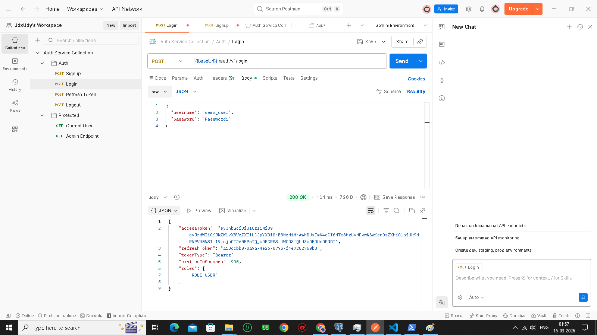

### Refresh Token Flow
Shows access token renewal using refresh token.

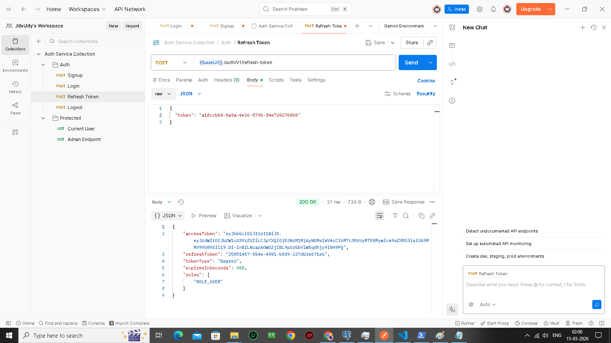

### Protected Endpoint
Shows authenticated access with a valid bearer token.

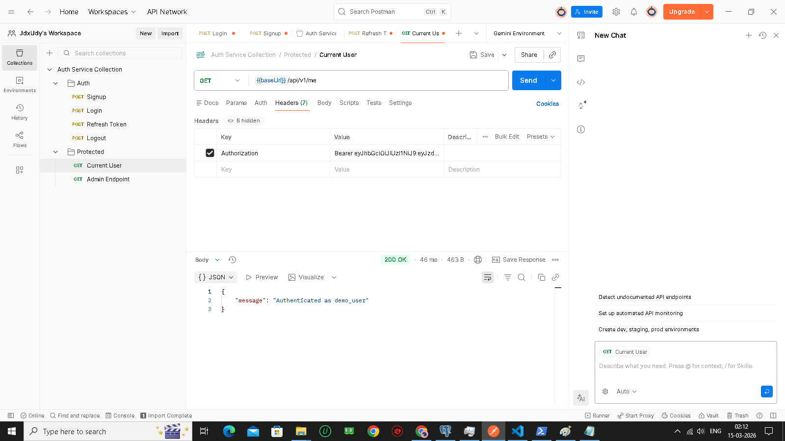

### Admin Access Denied
Shows role-based authorization working correctly for a non-admin user.

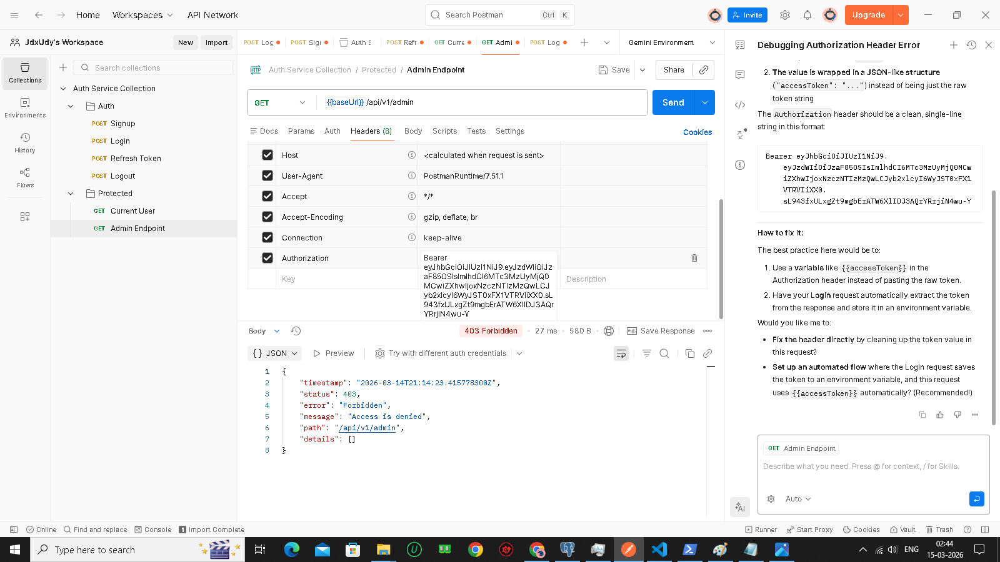

### Logout Success
Shows refresh-token revocation in action.

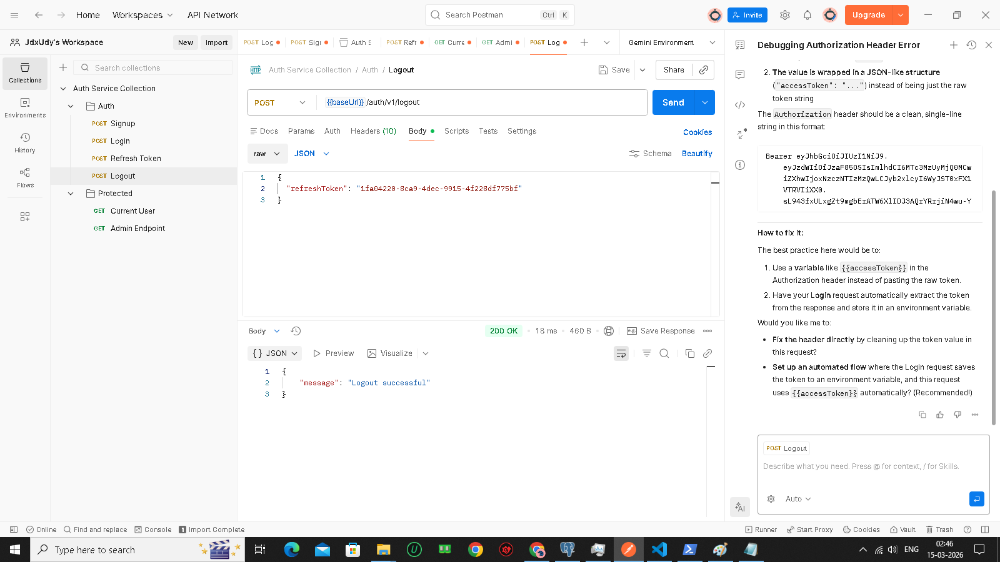

### Database Tables
Shows persisted users, roles, and refresh tokens.

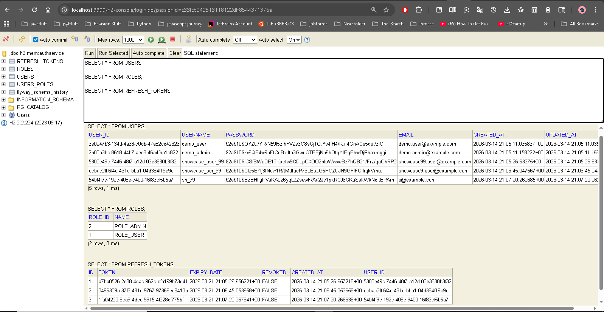

### Bonus Validation Screenshot
Shows duplicate-user handling and structured error responses.

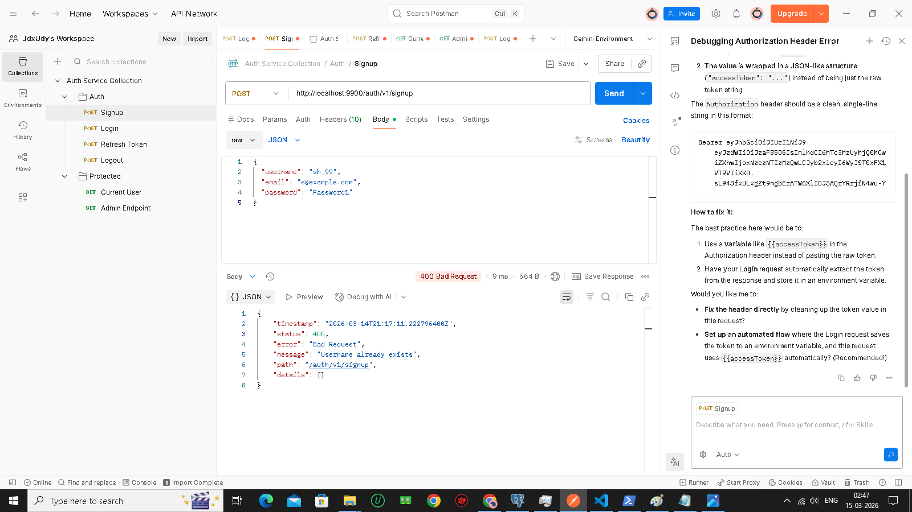

### Bonus Invalid Token Screenshot
Shows what happens when a refresh token or invalid token is used against a protected endpoint.

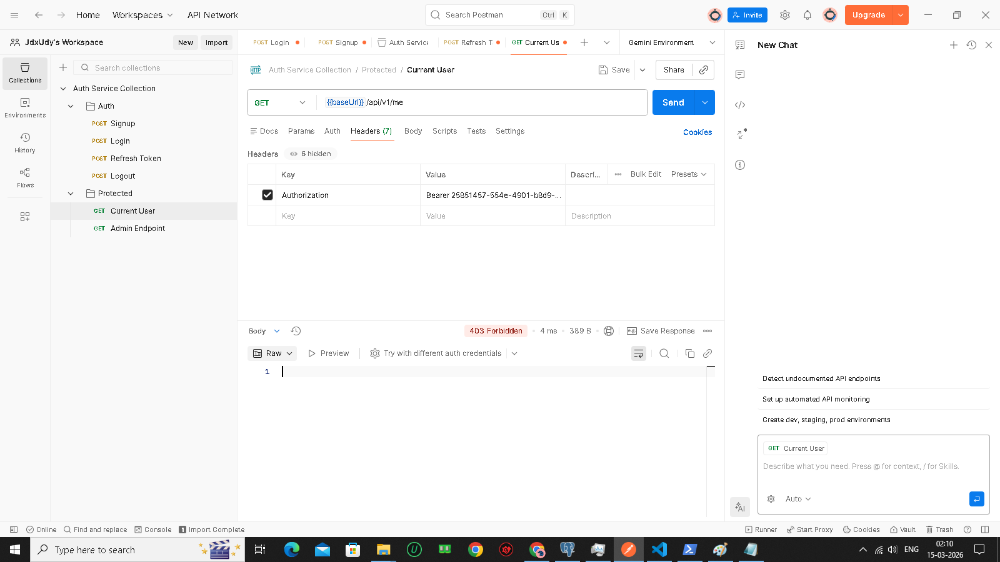

### Remaining Optional Screenshot
- Add `docs/screenshots/ci-passing.png` after your GitHub Actions workflow is green.

## Resume-Ready Highlights

- Built a secure authentication service using Spring Boot, Spring Security, JWT, and PostgreSQL with login, signup, logout, refresh-token rotation-style revocation, and role-based authorization.
- Added Flyway migrations, automated tests, Docker-based local setup, Swagger documentation, and a Postman collection to make the service easy to validate and demo.

## Next Additions

- capture README screenshots after running the app and Postman flows
- add integration tests with Testcontainers
