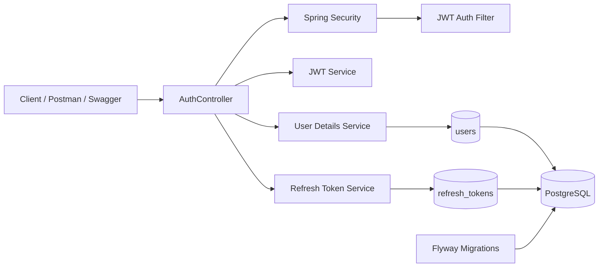

# Architecture Diagram

```mermaid
flowchart LR
    Client[Client / Postman / Swagger] --> AuthController[AuthController]
    AuthController --> Security[Spring Security]
    Security --> JwtFilter[JWT Auth Filter]
    AuthController --> JwtService[JWT Service]
    AuthController --> RefreshTokenService[Refresh Token Service]
    AuthController --> UserDetailsService[User Details Service]
    UserDetailsService --> UserRepo[(users)]
    RefreshTokenService --> RefreshRepo[(refresh_tokens)]
    UserRepo --> Postgres[(PostgreSQL)]
    RefreshRepo --> Postgres
    Flyway[Flyway Migrations] --> Postgres
```
