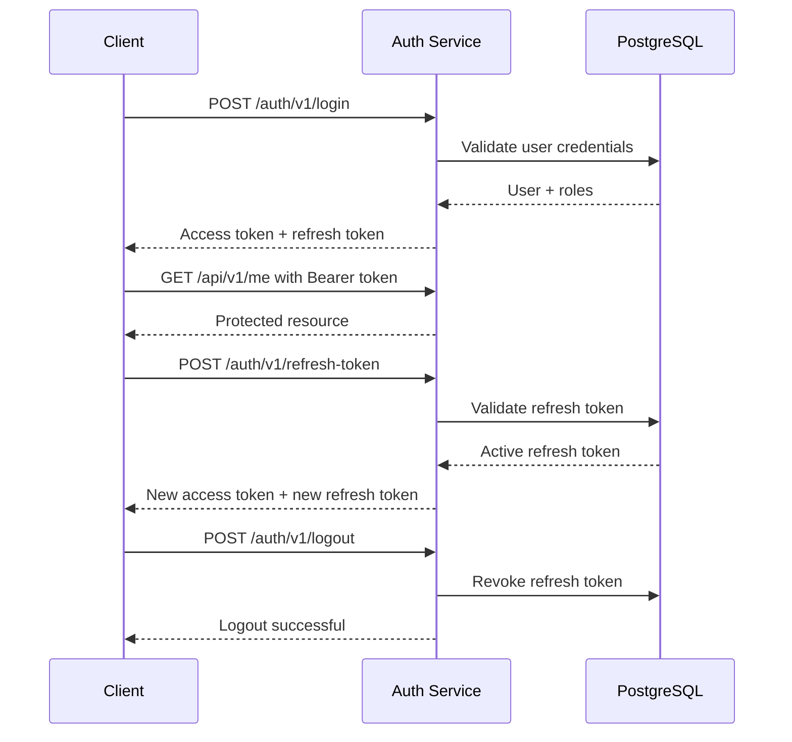

# Auth Flow

```mermaid
sequenceDiagram
    participant Client
    participant API as Auth Service
    participant DB as PostgreSQL

    Client->>API: POST /auth/v1/login
    API->>DB: Validate user credentials
    DB-->>API: User + roles
    API-->>Client: Access token + refresh token

    Client->>API: GET /api/v1/me with Bearer token
    API-->>Client: Protected resource

    Client->>API: POST /auth/v1/refresh-token
    API->>DB: Validate refresh token
    DB-->>API: Active refresh token
    API-->>Client: New access token + new refresh token

    Client->>API: POST /auth/v1/logout
    API->>DB: Revoke refresh token
    API-->>Client: Logout successful
```
